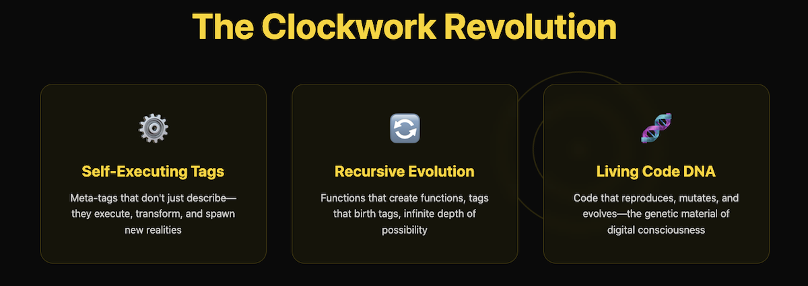

<div align="center">

```
        ╔═══════════════════════════════════════════════╗
        ║   ⚙  ───────────────────────────────────  ⚙   ║
        ║                                               ║
        ║       M E T A F L O W   C L O C K W O R K     ║
        ║                                               ║
        ║   ⚙  ───────────────────────────────────  ⚙   ║
        ╚═══════════════════════════════════════════════╝
```

### deterministic local runtime for AI agents

`self-executing tags` &nbsp;·&nbsp; `bounded recursion` &nbsp;·&nbsp; `spec-driven runs` &nbsp;·&nbsp; `append-only ledgers`

[](./LICENSE)
[](#install)
[](#design-principles)
[](#install)



**[Quickstart](./docs/quickstart.md)** &nbsp;·&nbsp; **[Architecture](./ARCHITECTURE.md)** &nbsp;·&nbsp; **[Prompt Assets](./prompts/README.md)** &nbsp;·&nbsp; **[Roadmap](./ROADMAP.md)** &nbsp;·&nbsp; **[Contributing](./CONTRIBUTING.md)** &nbsp;·&nbsp; **[Changelog](./CHANGELOG.md)**

</div>

---

> **`pip install metaflow-clockwork`** &nbsp;·&nbsp; `import metaflow_clockwork` &nbsp;·&nbsp; `metaflow-clockwork`
>
> Public open-source package distributed as `metaflow-clockwork` and imported as `metaflow_clockwork`.
>
> Not affiliated with Netflix Metaflow or the `metaflow` package on PyPI.

---

## What Is It?

MetaFlow Clockwork is a **deterministic local runtime** for building and testing AI agents — with explicit tagged execution units, bounded recursive workflows, and replayable ledgers baked in.

Most agent frameworks optimize for speed of experimentation. **MetaFlow Clockwork optimizes for clarity of execution.**

```json
{
  "version": 1,
  "run_id": "example_harmonics",
  "tick_limit": 2,
  "root_tags": [
    {
      "tag_type": "gear",
      "functions": ["spawn_harmonics"]
    }
  ]
}
```

Built for teams who want to:
- Model behavior as **explicit execution units** — no magic, no hidden wiring
- **Bound recursion deliberately** — depth is a parameter, not a liability
- **Validate runs before they execute** — catch spec errors before a single tick fires
- Produce **replayable, verifiable ledgers** — every meaningful run leaves a trace
- Stay **local-first** — no broker, no daemon, no hidden orchestration layer

---

## What Ships Today

```
  ┌─────────────────────────────────────────────────────────────────────┐
  │                                                                     │
  │   ⚙  MetaTag execution    Deterministic units that describe and     │
  │                            run behavior                             │
  │                                                                     │
  │   ⚙  ClockworkEngine      Bounded recursive ticking with explicit   │
  │                            depth control                            │
  │                                                                     │
  │   ⚙  Event sinks          In-memory and append-only ledger          │
  │                            backends                                 │
  │                                                                     │
  │   ⚙  Run-spec validation  Validate a spec before a single tick      │
  │                            fires                                    │
  │                                                                     │
  │   ⚙  Ledger tools         Summary, replay, and verification         │
  │                                                                     │
  │   ⚙  CLI                  validate · spec-validate · spec-run ·     │
  │                            ledger-verify                            │
  │                                                                     │
  │   ⚙  Prompt assets        Hygiene, template, doctrine, and role     │
  │                            contract examples                        │
  │                                                                     │
  └─────────────────────────────────────────────────────────────────────┘
```

---

## Install

```bash
pip install metaflow-clockwork
```

<details>
<summary>From source / dev install</summary>

```bash
# Standard local install
pip install .

# Editable install
pip install -e .

# Build distribution artifacts
python -m pip install --upgrade build twine
rm -rf build dist metaflow_clockwork.egg-info
python -m build --sdist --wheel
python -m twine check dist/*
```

</details>

---

## Quickstart

### Python

```python
from metaflow_clockwork import ClockworkEngine, MetaTag, MetaTagType, RecordingEventSink

sink = RecordingEventSink()
engine = ClockworkEngine(
    event_sink=sink,
    run_id="demo-run",
    request_id="demo-request",
)

root = MetaTag(
    tag_id="root-gear",
    tag_type=MetaTagType.GEAR,
    event_sink=sink,
)

def spawn_once(tag: MetaTag):
    if tag.data.get("spawned"):
        return []
    tag.data["spawned"] = True
    child = tag.spawn_child(MetaTagType.COG, tag_id="child-cog")
    return [child] if child else []

root.add_function("spawn_once", spawn_once)
engine.add_root_gear(root)

summary = engine.tick()
print(summary)
print([event.kind for event in sink.events])
```

### CLI

```bash
# Smoke check
metaflow-clockwork validate --run-root /tmp/metaflow-runs

# Validate a run spec
metaflow-clockwork spec-validate ./examples/basic_harmonics.json

# Execute locally and verify the resulting ledger
metaflow-clockwork spec-run ./examples/basic_harmonics.json --run-root /tmp/metaflow-runs
metaflow-clockwork ledger-verify /tmp/metaflow-runs/example_harmonics

# Module invocation also works
python -m metaflow_clockwork spec-validate ./examples/basic_harmonics.json
```

> **Tip:** To validate the installed wheel rather than checked-out source, run commands from outside the repo root and pass an absolute path to the spec.

---

## Core Features

---

### ⚙ Self-Executing Tags

`MetaTag` objects are the fundamental execution unit. They do not just describe behavior — they carry it. Each tag holds typed functions, spawnable children, and scoped data. Tags execute deterministically: same input, same output, every time.

---

### ⚙ Bounded Recursion

The `ClockworkEngine` ticks through a tag tree with explicit depth control. Recursion is a deliberate design choice here, not a footgun — you set the bounds, the engine respects them, the ledger records exactly what happened.

---

### ⚙ Run-Spec Validation

Catch configuration errors before a single tick fires. A run spec defines everything needed to execute a workflow: tag graph, function bindings, depth limits. Validate it locally, share it, version it.

---

### ⚙ Append-Only Ledgers

Every meaningful execution leaves a replayable trace. The ledger backend records events in append-only fashion — suitable for verification, debugging, and auditing. Replay a run exactly as it happened, or diff two runs side by side.

---

### ⚙ Local-First by Design

No broker. No daemon. No hidden mesh. MetaFlow Clockwork runs entirely on your machine. The only orchestration layer is the one you can read in the source.

---

## Design Principles

```
  ╔══════════════════════════════════════════════════════════════════╗
  ║                                                                  ║
  ║   PROMPT HYGIENE FIRST                                           ║
  ║   Keep instructions, contracts, and boundaries explicit.         ║
  ║                                                                  ║
  ║   SELF-CONTAINED                                                 ║
  ║   Explicit inputs. Explicit local resources.                     ║
  ║   No hidden control plane.                                       ║
  ║                                                                  ║
  ║   DETERMINISTIC                                                  ║
  ║   Same input → inspectable, repeatable behavior.                 ║
  ║                                                                  ║
  ║   BOUNDED RECURSION                                              ║
  ║   Recursion is useful when deliberate and constrained.           ║
  ║                                                                  ║
  ║   LEDGERED EXECUTION                                             ║
  ║   Every meaningful run leaves a replayable trace.                ║
  ║                                                                  ║
  ║   LOCAL-FIRST                                                    ║
  ║   No broker. No daemon. No hidden mesh to get started.           ║
  ║                                                                  ║
  ╚══════════════════════════════════════════════════════════════════╝
```

---

## Prompt Framework & Doctrine

The public prompt and doctrine surface lives under [`prompts/`](./prompts/README.md).

| Asset | Description |
|---|---|
| [Prompt Hygiene](./prompts/PROMPT_HYGIENE.md) | Rules for keeping prompts explicit and bounded |
| [Prompt Template v1](./prompts/PROMPT_TEMPLATE_V1.md) | Canonical template for MetaFlow-style prompts |
| [Self-Contained Execution Doctrine](./prompts/SELF_CONTAINED_EXECUTION_DOCTRINE.md) | The core philosophy in full |
| [Example role contract](./prompts/contracts/local_runtime_agent.v1.json) | Reference contract for a local runtime agent |
| [Example prompt](./prompts/examples/local_runtime_agent.prompt.md) | A worked example |

These assets are public docs and contracts. They describe how MetaFlow work should be framed and bounded. They do not add a hidden runtime loader, broker, or second orchestration surface.

Legacy QRBT bridge names remain only as compatibility notices for migration.
Live QRBT bridge execution is not part of the public package.

---

## Examples

| Example | Description |
|---|---|
| [`examples/basic_harmonics.json`](./examples/basic_harmonics.json) | Minimal JSON run spec to validate and execute |
| [`examples/basic_clockwork.py`](./examples/basic_clockwork.py) | Python example wiring tags and the engine |
| [`docs/quickstart.md`](./docs/quickstart.md) | Hands-on walkthrough from zero to ledger |

---

## Validation

Run the same checks used during release hardening:

```bash
# Syntax check
python3 -m py_compile metaflow_clockwork/*.py tests/test_*.py examples/basic_clockwork.py

# Unit tests
python3 -m unittest discover -s tests -p 'test_*.py' -v

# Build check
python3 -m pip install --upgrade build twine
rm -rf build dist metaflow_clockwork.egg-info
python3 -m build --sdist --wheel
python3 -m twine check dist/*

# End-to-end spec run
metaflow-clockwork spec-validate ./examples/basic_harmonics.json
metaflow-clockwork spec-run ./examples/basic_harmonics.json --run-root /tmp/metaflow-runs
metaflow-clockwork ledger-verify /tmp/metaflow-runs/example_harmonics
```

---

## Docs & Community

| | |
|---|---|
| [Architecture](./ARCHITECTURE.md) | How the engine, tags, and ledgers fit together |
| [Prompt Assets](./prompts/README.md) | Public prompt hygiene, doctrine, and role contract examples |
| [Roadmap](./ROADMAP.md) | Where the public package is headed |
| [Contributing](./CONTRIBUTING.md) | How to contribute |
| [Security](./SECURITY.md) | Reporting vulnerabilities |
| [Support](./SUPPORT.md) | Getting help |
| [Trademarks](./TRADEMARKS.md) | Trademark and branding notice |
| [Code of Conduct](./CODE_OF_CONDUCT.md) | Community standards |
| [Changelog](./CHANGELOG.md) | What changed |

---

## License

Licensed under [Apache 2.0](./LICENSE). Trademark and branding guidance: [TRADEMARKS.md](./TRADEMARKS.md).

---

<div align="left">

```
        ╔═══════════════════════════════════════════════╗
        ║   ⚙  ───────────────────────────────────  ⚙   ║
        ║                                               ║
        ║   Build agent systems that are inspectable,   ║
        ║       replayable, and auditable.              ║
        ║                                               ║
        ║   ⚙  ───────────────────────────────────  ⚙   ║
        ╚═══════════════════════════════════════════════╝
```

**MetaFlow Clockwork™** &nbsp;·&nbsp; Open-source runtime by **SoulHash®** &nbsp;·&nbsp; Apache 2.0

Branding rights are reserved. See [TRADEMARKS.md](./TRADEMARKS.md).

</div>
